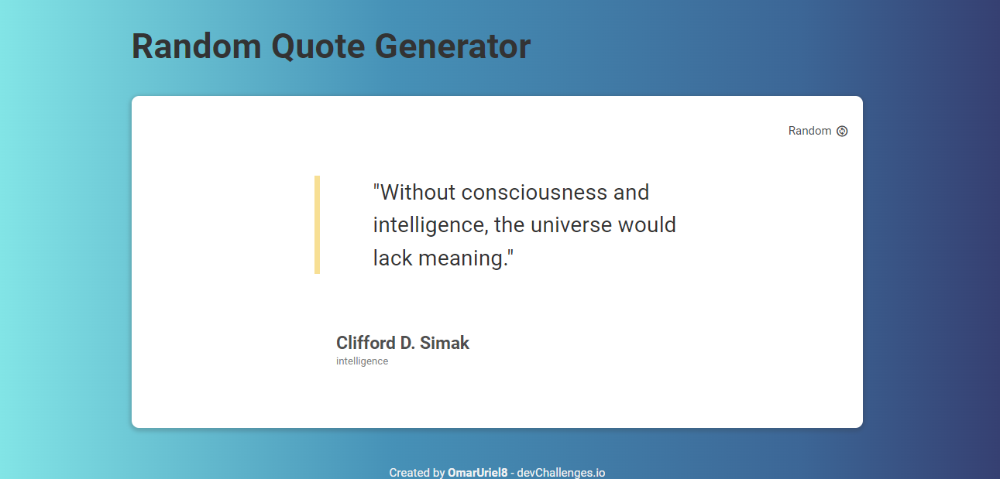

# Random Quote Generator

---

## Tabla de contenido
---

- [Vista general](#vista-general)
- [Sobre el proyecto](#sobre-el-proyecto)
- [Recursos](#recursos)
- [Construido con](#construido-con)
- [Comó usarlo](#como-usarlo)

## Vista General

---

Pantalla principal



## Sobre el proyecto

---

App que genera citas aleatorias, al darle a algun autor se muestran como maximo 20 citas del autor seleccionado 

## Recursos

---

Este diseño fue construida en base al reto Random quote generator del sitio [DevChallenge](https://devchallenges.io/challenges/8Y3J4ucAMQpSnYTwwWW8).

## Construido con

---

- Vite
- React
- Emotion
- React-router-dom v6

## Como usarlo

---

Comandos para la terminal

```bash
# Instalar dependencias
$ npm install

# Correr la app
$ npm run dev
```
